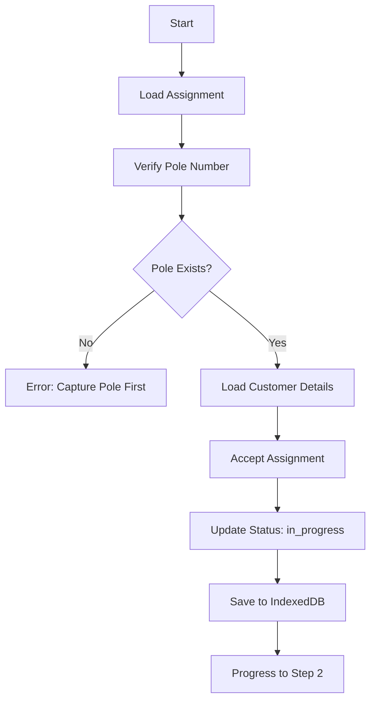
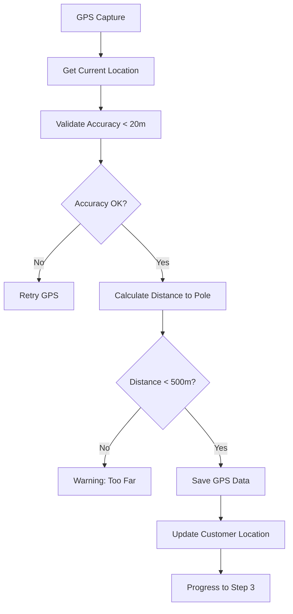
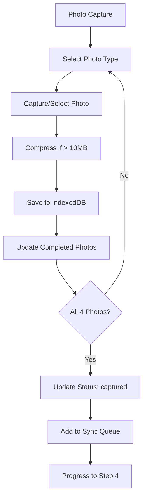
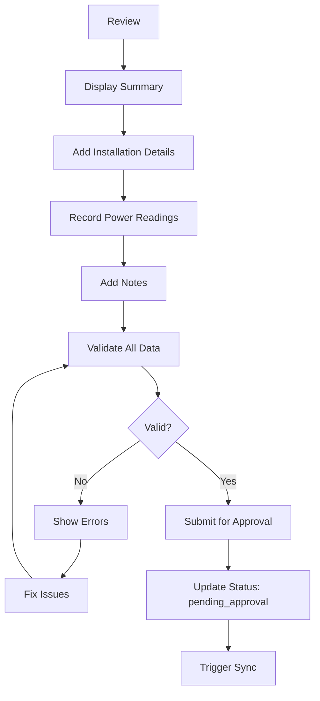
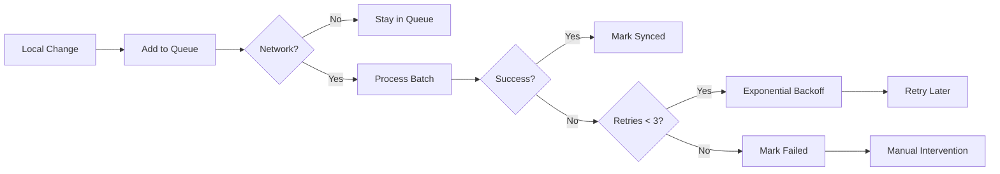
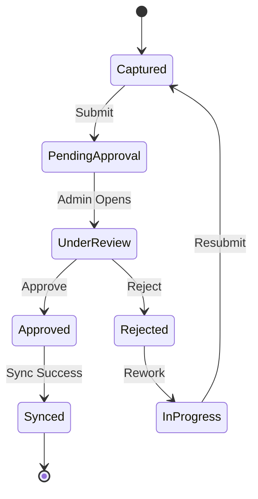

# Home Drop Capture - Data Architecture & Service Design

## Executive Summary

The Home Drop Capture feature extends the existing FibreField pole capture system to support fiber-to-the-home installations. This architecture follows the same offline-first patterns while introducing a structured 4-step workflow optimized for home installations.

## Core Architecture Principles

1. **Pole-Centric Design**: Every home drop MUST be connected to a pole number
2. **Offline-First**: All data stored locally in IndexedDB via Dexie.js
3. **Progressive Workflow**: 4-step process with save-and-resume capability
4. **Photo-Driven Validation**: 4 specific photo types required for completion
5. **Admin Approval Flow**: Quality assurance through approval workflow
6. **QGIS Integration**: Export capability for GeoPackage format

## Data Model Architecture

### Primary Entities

```typescript
HomeDropCapture (Primary Entity)
├── id: string (HD-{timestamp}-{random})
├── poleNumber: string (REQUIRED - foreign key to PoleCapture)
├── status: HomeDropStatus
├── workflow: WorkflowTracking
├── customer: CustomerDetails
├── installation: InstallationDetails
├── photos: HomeDropPhoto[]
├── gpsLocation: GPSData
├── approval: ApprovalWorkflow
└── metadata: Timestamps & User Info

HomeDropPhotoStorage (Photo Storage)
├── id: string
├── homeDropId: string (foreign key)
├── type: HomeDropPhotoType
├── data: string (base64)
├── uploadStatus: UploadStatus
└── metadata: PhotoMetadata

HomeDropAssignment (Work Assignment)
├── id: string
├── homeDropId: string (foreign key)
├── poleNumber: string
├── customer: CustomerInfo
├── assignedTo: string (technician)
├── priority: Priority
└── status: AssignmentStatus

HomeDropSyncQueue (Offline Sync)
├── id: string
├── homeDropId: string (foreign key)
├── action: SyncAction
├── data: Partial<HomeDropCapture>
├── priority: QueuePriority
└── status: SyncStatus
```

### Database Schema (IndexedDB/Dexie)

```javascript
// Version 2 Schema Extension
homeDropCaptures: '&id, poleNumber, projectId, contractorId, status, syncStatus, capturedBy, [projectId+status], [poleNumber+status]'
homeDropPhotos: '&id, homeDropId, type, uploadStatus, [homeDropId+type]'
homeDropAssignments: '&id, homeDropId, poleNumber, assignedTo, status, [assignedTo+status]'
homeDropSyncQueue: '&id, homeDropId, action, status, priority, [status+priority]'
```

## Service Architecture

### Service Layer Design

```
┌─────────────────────────────────────────────────────────┐
│                    UI Components                         │
│  (HomeDropWizard, PhotoCapture, GPSCapture, Review)     │
└─────────────────────────────────────────────────────────┘
                              │
                              ▼
┌─────────────────────────────────────────────────────────┐
│              HomeDropCaptureService                      │
│  - Workflow Management                                   │
│  - Photo Compression & Storage                           │
│  - GPS Validation & Distance Calculation                 │
│  - Quality Validation                                    │
│  - Approval Workflow                                     │
└─────────────────────────────────────────────────────────┘
                              │
                    ┌─────────┴─────────┐
                    ▼                   ▼
┌─────────────────────────┐   ┌─────────────────────────┐
│   Dexie.js (IndexedDB)  │   │  PoleCaptureService     │
│   - Local Storage       │   │  - Pole Validation      │
│   - Offline Queue       │   │  - Distance Calc        │
│   - Live Queries        │   │  - Nearest Poles        │
└─────────────────────────┘   └─────────────────────────┘
                    │
                    ▼
┌─────────────────────────────────────────────────────────┐
│                   Sync Service                           │
│  - Firebase Firestore Sync                              │
│  - Firebase Storage (Photos)                            │
│  - Conflict Resolution                                  │
│  - Retry Logic with Exponential Backoff                 │
└─────────────────────────────────────────────────────────┘
```

### Service Methods Overview

```typescript
class HomeDropCaptureService {
  // CRUD Operations
  createHomeDropCapture(data: Partial<HomeDropCapture>): Promise<string>
  getHomeDropCapture(id: string): Promise<HomeDropCapture>
  updateHomeDropCapture(id: string, data: Partial<HomeDropCapture>): Promise<void>
  deleteHomeDropCapture(id: string): Promise<void>
  
  // Workflow Management
  progressWorkflow(id: string, step: WorkflowStep): Promise<void>
  saveProgress(id: string, step: number, data?: any): Promise<void>
  
  // Assignment Management
  createAssignment(homeDropId: string, assignment: Assignment): Promise<string>
  getAssignmentsForTechnician(technicianId: string): Promise<Assignment[]>
  
  // Photo Management
  addPhoto(homeDropId: string, photo: HomeDropPhoto): Promise<void>
  removePhoto(homeDropId: string, photoType: string): Promise<void>
  compressPhoto(photo: HomeDropPhoto): Promise<HomeDropPhoto>
  
  // GPS Management
  updateGPSLocation(homeDropId: string, location: GPSData): Promise<void>
  calculateDistanceFromPole(homeDropId: string): Promise<number>
  
  // Installation Details
  updateInstallationDetails(homeDropId: string, details: Installation): Promise<void>
  validateOpticalPower(power: number): boolean
  
  // Quality & Approval
  submitForApproval(homeDropId: string): Promise<void>
  approveHomeDropCapture(homeDropId: string, approvedBy: string): Promise<void>
  rejectHomeDropCapture(homeDropId: string, rejectedBy: string, reason: string): Promise<void>
  validateHomeDropCapture(homeDropCapture: HomeDropCapture): ValidationResult
  
  // Sync Queue
  processSyncQueue(): Promise<void>
  getSyncQueue(): Promise<SyncQueueItem[]>
  
  // Statistics & Export
  getStatistics(): Promise<HomeDropStatistics>
  exportToGeoPackage(ids?: string[]): Promise<GeoPackageExport[]>
  
  // Live Queries (Reactive)
  watchHomeDropCaptures(): Observable<HomeDropCapture[]>
  watchSyncQueue(): Observable<SyncQueueItem[]>
}
```

## 4-Step Workflow Data Flow

### Step 1: Assignments



**Data Updates:**
- `status`: 'assigned' → 'in_progress'
- `workflow.steps.assignments`: true
- `workflow.currentStep`: 1 → 2
- `assignment`: Assignment details embedded

### Step 2: GPS Capture



**Data Updates:**
- `gpsLocation`: Complete GPS data with timestamp
- `customer.location`: GPS coordinates
- `distanceFromPole`: Calculated distance in meters
- `workflow.steps.gps`: true
- `workflow.currentStep`: 2 → 3

### Step 3: Photo Capture



**Required Photo Types:**
1. `power-meter-test`: Optical power reading display
2. `fibertime-setup-confirmation`: Setup confirmation screen
3. `fibertime-device-actions`: Device configuration actions
4. `router-4-lights-status`: Router with all 4 lights active

**Data Updates:**
- `photos[]`: Array of captured photos
- `completedPhotos[]`: List of completed photo types
- `workflow.steps.photos`: true (when all 4 complete)
- `workflow.currentStep`: 3 → 4
- `status`: 'in_progress' → 'captured'

### Step 4: Review & Submit



**Data Updates:**
- `installation`: Equipment, power readings, service config
- `qualityChecks`: Validation results
- `notes`: Technical notes and comments
- `workflow.steps.review`: true
- `status`: 'captured' → 'pending_approval'
- `capturedAt`: Completion timestamp

## Sync Queue Architecture

### Sync Priority System

```typescript
Priority Levels:
- HIGH: Create/Update home drop data
- MEDIUM: Status changes, approval updates
- LOW: Photo uploads, non-critical updates

Queue Processing:
1. Group by priority
2. Process HIGH priority first
3. Batch process (5 items default)
4. Exponential backoff on failure
5. Max 3 retry attempts
```

### Sync Flow Diagram



## Data Validation Rules

### Required Field Validation

```typescript
interface ValidationRules {
  // Required Fields
  poleNumber: Required & MustExist
  customer.name: Required & MinLength(2)
  customer.address: Required & MinLength(5)
  gpsLocation: Required & AccuracyThreshold(20m)
  
  // Photo Requirements
  photos: {
    required: ['power-meter-test', 'fibertime-setup-confirmation', 
               'fibertime-device-actions', 'router-4-lights-status']
    maxSize: 10MB
    minQuality: 0.7
  }
  
  // Technical Validation
  opticalPower: Range(-30dBm, -8dBm)
  distanceFromPole: MaxDistance(500m)
  
  // Quality Scores
  overallQuality: MinScore(70/100)
  photoQuality: MinScore(70/100)
}
```

### Validation Process

1. **Field Validation**: Check all required fields present
2. **Photo Validation**: Verify all 4 photos captured and valid
3. **GPS Validation**: Ensure accuracy < 20m and distance < 500m
4. **Power Validation**: Check optical power within range
5. **Quality Score**: Calculate overall quality score
6. **Approval Ready**: All validations must pass

## Admin Approval Workflow



### Approval Data Structure

```typescript
approval: {
  status: 'pending' | 'approved' | 'rejected'
  approvedBy?: string        // Admin user ID
  approvedAt?: Date          // Approval timestamp
  rejectionReason?: string   // Why rejected
  rejectionNotes?: string    // Detailed feedback
  requiresRework?: boolean   // Needs technician action
}
```

## QGIS/QField Integration

### GeoPackage Export Format

```typescript
interface HomeDropGeoPackageExport {
  // Geometry (GeoJSON Point)
  geometry: {
    type: 'Point'
    coordinates: [longitude, latitude]
  }
  
  // Properties
  properties: {
    id: string
    poleNumber: string
    customerName: string
    customerAddress: string
    installationDate: string
    status: string
    opticalPower?: number
    serviceActive: boolean
    technicianName?: string
    photos: Array<{type: string, url: string}>
  }
  
  // Feature Type
  type: 'Feature'
}
```

### Export Process

1. Query home drops (filtered or all)
2. Transform to GeoJSON features
3. Include photo URLs (Firebase Storage)
4. Generate GeoPackage file
5. Enable offline viewing in QField

## Performance Optimizations

### IndexedDB Indexes

```javascript
Compound Indexes for Performance:
- [projectId+status]: Filter by project and status
- [poleNumber+status]: Find home drops by pole
- [contractorId+status]: Contractor workload
- [status+syncStatus]: Sync queue management
- [assignedTo+status]: Technician assignments
- [uploadStatus+capturedAt]: Photo upload queue
```

### Caching Strategy

1. **Photo Compression**: Reduce to 2048px max dimension
2. **Lazy Loading**: Load photos on demand
3. **Live Queries**: Use Dexie live queries for reactive UI
4. **Batch Operations**: Process sync queue in batches
5. **Auto-cleanup**: Remove synced data after 30 days

### Memory Management

- Compress photos before storage (0.8 quality)
- Limit photo size to 10MB
- Use base64 encoding for offline storage
- Clean up old synced data automatically
- Implement pagination for large lists

## Security Considerations

### Data Protection

1. **Authentication**: Firebase Auth integration
2. **Authorization**: Role-based access control
3. **Data Encryption**: Sensitive data encrypted at rest
4. **Photo Privacy**: No EXIF location data exposed
5. **Audit Trail**: All changes tracked with timestamps

### Offline Security

1. **Local Storage**: IndexedDB with browser security
2. **Session Management**: Auto-logout on idle
3. **Data Expiry**: Old offline data auto-deleted
4. **Sync Authentication**: Token-based sync auth
5. **Conflict Resolution**: Server authority on conflicts

## Error Handling

### Error Categories

```typescript
enum ErrorType {
  VALIDATION_ERROR,      // Data validation failed
  NETWORK_ERROR,        // Sync/upload failed
  STORAGE_ERROR,        // IndexedDB error
  GPS_ERROR,           // Location services error
  PHOTO_ERROR,         // Camera/photo error
  SYNC_CONFLICT,       // Data conflict during sync
  PERMISSION_ERROR     // User lacks permission
}
```

### Recovery Strategies

1. **Auto-save**: Save progress every 30 seconds
2. **Retry Logic**: Exponential backoff for sync
3. **Offline Queue**: Queue changes when offline
4. **Conflict Resolution**: Last-write-wins with versioning
5. **Error Reporting**: Log errors for debugging

## Testing Strategy

### Unit Tests

```typescript
describe('HomeDropCaptureService', () => {
  test('creates home drop with required pole number')
  test('validates GPS accuracy threshold')
  test('calculates distance from pole correctly')
  test('compresses photos over size limit')
  test('validates all 4 required photos')
  test('handles sync queue retry logic')
  test('exports to GeoPackage format')
})
```

### Integration Tests

1. Full workflow completion (4 steps)
2. Photo capture and compression
3. GPS validation with pole distance
4. Sync queue processing
5. Admin approval workflow
6. QGIS export functionality

### E2E Tests

1. Complete home drop capture flow
2. Offline capture and sync
3. Multiple technician workflows
4. Admin review and approval
5. Data export and import

## Migration & Deployment

### Database Migration

```javascript
// Version 2: Add home drop tables
db.version(2).stores({
  // Existing tables preserved...
  // New home drop tables added
  homeDropCaptures: '...',
  homeDropPhotos: '...',
  homeDropAssignments: '...',
  homeDropSyncQueue: '...'
})
```

### Rollout Strategy

1. **Phase 1**: Deploy schema, no UI (test data layer)
2. **Phase 2**: Limited beta with select technicians
3. **Phase 3**: Full rollout with training
4. **Phase 4**: QGIS integration activation
5. **Phase 5**: Analytics and optimization

## Monitoring & Analytics

### Key Metrics

```typescript
interface HomeDropMetrics {
  // Performance
  averageCaptureTime: number      // Minutes
  photoCaptureSuccess: number     // Percentage
  syncSuccessRate: number         // Percentage
  
  // Quality
  approvalRate: number            // Percentage
  reworkRate: number              // Percentage
  averageQualityScore: number     // 0-100
  
  // Operational
  dailyCaptures: number
  pendingApprovals: number
  syncQueueSize: number
  offlineCaptures: number
}
```

### Monitoring Points

1. Workflow completion rates per step
2. Photo quality and compression stats
3. GPS accuracy distribution
4. Sync queue performance
5. Error rates by category
6. Admin approval turnaround time

## Future Enhancements

### Planned Features

1. **Bulk Operations**: Multiple home drops per session
2. **Route Optimization**: Suggested capture order
3. **AI Photo Validation**: Automatic quality checks
4. **Voice Notes**: Audio recording for notes
5. **Signature Capture**: Customer sign-off
6. **Real-time Collaboration**: Live status updates
7. **Advanced Analytics**: Predictive maintenance
8. **Integration APIs**: Third-party system integration

### Technical Debt

1. Implement proper Firebase sync
2. Add comprehensive error tracking
3. Optimize photo compression algorithm
4. Implement data encryption
5. Add automated testing suite
6. Create admin dashboard
7. Build analytics pipeline
8. Document API endpoints

---

## Conclusion

The Home Drop Capture architecture extends FibreField's proven offline-first approach while introducing specialized workflows for home installations. The pole-centric design ensures data integrity, while the 4-step workflow provides structure and flexibility for field technicians. With comprehensive validation, admin approval, and QGIS integration, this system provides a complete solution for fiber-to-the-home deployment tracking.